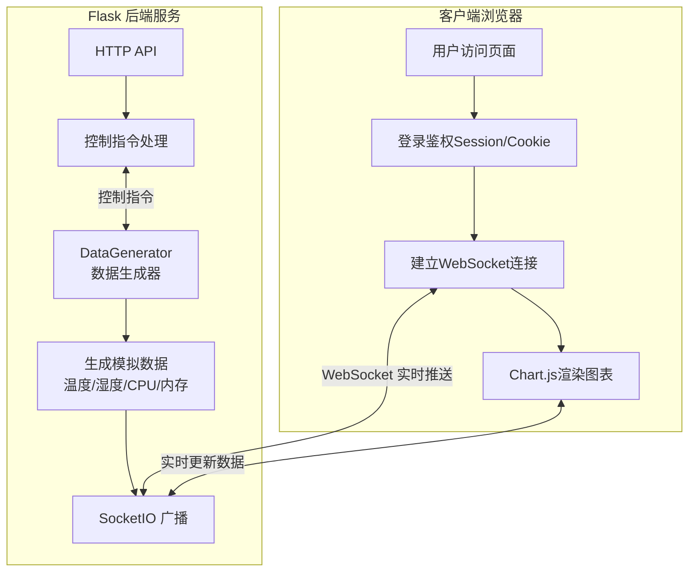

# 实时数据监控系统 (Real-time Data Monitor)


一个基于 Flask + WebSocket 的实时数据监控平台，支持在 PC 和移动端实时查看模拟数据变化。

## 📋 项目简介

本项目是一个前后端分离的实时数据监控系统演示。系统通过 Python 后端生成模拟的传感器数据（如温度、湿度、CPU、内存使用率），并利用 WebSocket 技术将数据实时推送到前端页面。前端采用响应式设计，完美适配手机和电脑屏幕，用户可以通过直观的图表查看数据变化趋势，并进行缩放、平移等操作。

### ✨ 核心特性

- **🔐 用户认证**: 支持用户名/密码登录，保护监控数据
- **⚡ 实时通信**: 基于 Flask-SocketIO 实现毫秒级数据推送
- **📱 移动优先**: 响应式界面设计，专为手机端优化
- **📈 交互式图表**: 支持缩放、平移、重置视图等操作
- **🔄 断线重连**: WebSocket 自动重连机制，保障连接稳定性
- **🎮 远程控制**: 支持通过网页控制数据生成器的启停

## 🛠️ 安装依赖

### 环境要求
- Python 3.8+
- pip (Python包管理器)

### 依赖安装

1. 克隆项目仓库（或下载源码）：

```bash

git clone <repository-url>

cd real-time-data-monitor
```

2. 创建并激活虚拟环境（推荐）：

```bash

python -m venv venv

# Windows

venv\Scripts\activate

# macOS/Linux

source venv/bin/activate
```
3. 安装项目依赖：
```bash
pip install -r requirements.txt
```
### 依赖清单
项目主要依赖如下（`requirements.txt`）：
| 包名 | 用途 |
|------|------|
| Flask | Web 框架 |
| Flask-SocketIO | WebSocket 实时通信支持 |
| Flask-CORS | 跨域资源共享 |
| python-socketio | Socket.IO 客户端/服务端 |
| eventlet | 异步并发处理 |
| numpy | 数值计算与数据处理 |

## 🚀 快速开始

### 启动服务

1. 确保已完成[安装依赖](#-安装依赖)。
2. 在项目根目录下运行主程序：

```bash
python app.py
```
3. 服务启动后，终端会显示访问地址：
```
服务器启动在: http://0.0.0.0:5000

手机访问地址: http://<电脑IP>:5000
```
### 访问系统

1. 打开浏览器访问 `http://localhost:5000`（或手机访问电脑IP地址）。
2. 在首页点击 **"进入系统"** 或 **"进入登录页面"**。
3. 使用以下测试账户登录：
   - **管理员账户**: `admin` / `admin123`
   - **普通用户账户**: `user` / `user123`

### 首次使用

登录成功后，您将进入 **仪表板页面**：
- 系统会自动开始生成模拟数据
- 页面展示温度、湿度、CPU、内存四个实时图表
- 可通过顶部按钮控制数据生成器的启停
- 支持图表缩放、平移等交互操作

**注意**：请确保手机和电脑连接在同一个WiFi网络下，以便手机端正常访问。

## 🔄 工作流程

本系统采用经典的客户端-服务器架构，结合 WebSocket 实现全双工实时通信。整个流程分为**数据生成**、**服务端处理**和**客户端渲染**三个主要阶段。

### 系统架构流程图


### 流程详解

1.  **启动与连接 (Startup & Connection)**  
    - 用户访问首页 (`/`)，系统重定向至登录页 (`/login`)。  
    - 用户提交凭据后，后端校验 `ALLOWED_USERS` 字典。验证通过后创建 Session。  
    - 登录成功后跳转至仪表板 (`/dashboard`)，前端 JavaScript 自动初始化 WebSocket 连接 (`io()`)。

2.  **数据生成 (Data Generation)**  
    - 后端 `DataGenerator` 类在独立线程中运行。  
    - 通过数学函数 (`sin`) 叠加随机数生成模拟数据（温度、湿度、CPU、内存）。  
    - 数据以每秒 1 次的频率更新，并存储在内存列表 (`data_points`) 中，最大保留 50 条。

3.  **实时推送 (Real-time Push)**  
    - 新数据生成后，`DataGenerator` 触发回调函数。  
    - 通过 `socketio.emit('new_data', data)` 将 JSON 数据包推送给所有已连接的客户端。

4.  **前端渲染 (Frontend Rendering)**  
    - 客户端 `WebSocketManager` 监听 `new_data` 事件。  
    - 接收到数据后，`ChartManager` 调用 `addData()` 方法更新图表数据集。  
    - Chart.js 在极短时间内重绘 Canvas，实现平滑的曲线滚动效果。

5.  **交互与控制 (Interaction & Control)**  
    - 用户可在前端点击“开始/停止”按钮。  
    - 指令通过 WebSocket (`start_generator` / `stop_generator`) 或 HTTP API 发送至后端。  
    - 后端调用 `DataGenerator.start()` 或 `stop()` 方法，动态控制数据流的开关。
